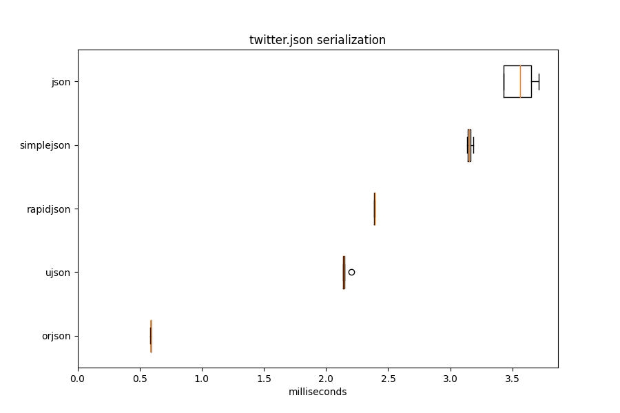
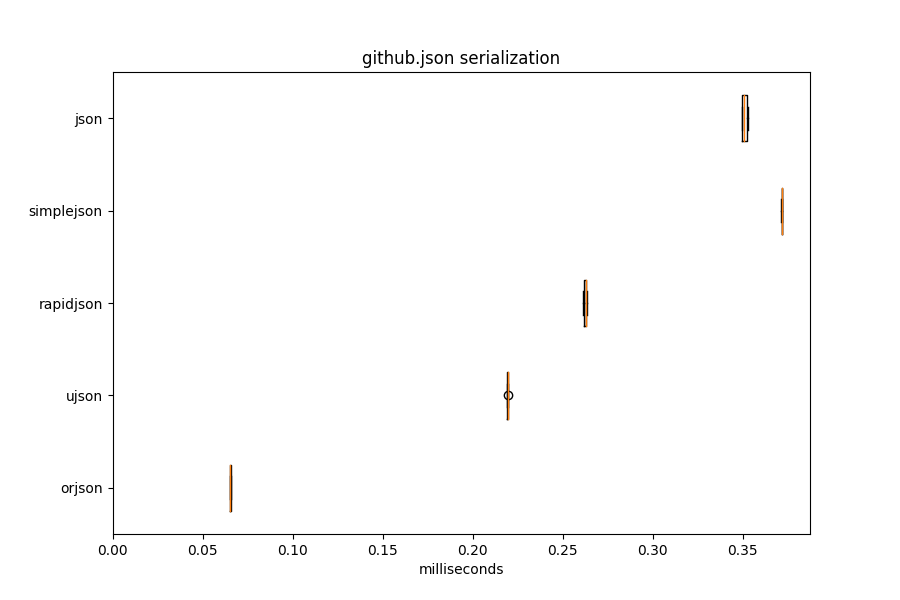

# orjson

orjson is a fast, correct JSON library for Python. It benchmarks as the
fastest Python library for JSON and has comprehensive unit, integration, and
interoperability tests.

Its serialization performance is 2x to 3x the nearest
other library and 4x to 12x the standard library. Its deserialization
performance is 0.9x to 1.1x the nearest other library and 1.1x to 2x
the standard library.

It differs in behavior from other Python JSON libraries in supporting
datetimes, not supporting subclasses without a `default` hook,
serializing UTF-8 to bytes rather than escaped ASCII (e.g., "好" rather than
"\\\u597d") by default, having strict UTF-8 conformance, having strict JSON
conformance on NaN/Infinity/-Infinity, having an option for strict
JSON conformance on 53-bit integers, not supporting pretty
printing, and not supporting all standard library options.

orjson supports CPython 3.5, 3.6, 3.7, and 3.8. It distributes wheels for Linux,
macOS, and Windows. The manylinux1 wheel differs from PEP 513 in requiring
glibc 2.18, released 2013, or later. orjson is licensed under both
the Apache 2.0 and MIT licenses. The repository and issue tracker is
[github.com/ijl/orjson](https://github.com/ijl/orjson), and patches may be
submitted there.

## Usage

### Install

To install a wheel from PyPI:

```sh
pip install --upgrade orjson
```

There are no runtime dependencies other than libc.

To build a release wheel from source, assuming a Rust nightly toolchain
and Python environment:

```sh
git clone https://github.com/ijl/orjson.git && cd orjson
pip install --upgrade pyo3-pack
pyo3-pack build --release --strip --interpreter python3.7
```

orjson is compatible with systems using glibc earlier than 2.18 if
compiled on such a system. Installing from source on a musl libc distribution
is not practical due to tooling.

### Serialize

```python
def dumps(__obj: Any, default: Optional[Callable[[Any], Any]] = ..., option: Optional[int] = ...) -> bytes: ...
```

`dumps()` serializes Python objects to JSON.

It natively serializes
`str`, `dict`, `list`, `tuple`, `int`, `float`, `datetime.datetime`,
`datetime.date`, `datetime.time`, and `None` instances. It supports
arbitrary types through `default`. It does not serialize subclasses of
supported types natively, but `default` may be used.

It accepts options via an `option` keyword argument. These include:

- `orjson.OPT_STRICT_INTEGER` for enforcing a 53-bit limit on integers. The
limit is otherwise 64 bits, the same as the Python standard library.
- `orjson.OPT_NAIVE_UTC` for assuming `datetime.datetime` objects without a
`tzinfo` are UTC.

To specify multiple options, mask them together, e.g.,
`option=orjson.OPT_STRICT_INTEGER | orjson.OPT_NAIVE_UTC`.

It raises `JSONEncodeError` on an unsupported type. This exception message
describes the invalid object.

It raises `JSONEncodeError` on a `str` that contains invalid UTF-8.

It raises `JSONEncodeError` on an integer that exceeds 64 bits by default or,
with `OPT_STRICT_INTEGER`, 53 bits.

It raises `JSONEncodeError` if a `dict` has a key of a type other than `str`.

It raises `JSONEncodeError` if the output of `default` recurses to handling by
`default` more than five levels deep.

It raises `JSONEncodeError`  if a `tzinfo` on a datetime object is incorrect.

`JSONEncodeError` is a subclass of `TypeError`. This is for compatibility
with the standard library.


```python
import orjson

try:
    val = orjson.dumps(...)
except orjson.JSONEncodeError:
    raise
```

To serialize arbitrary types, specify `default` as a callable that returns
a supported type. `default` may be a function, lambda, or callable class
instance.

```python
>>> import orjson, numpy
>>> def default(obj):
        if isinstance(obj, numpy.ndarray):
            return obj.tolist()
>>> orjson.dumps(numpy.random.rand(2, 2), default=default)
b'[[0.08423896597867486,0.854121264944197],[0.8452845446981371,0.19227780743524303]]'
```

If the `default` callable does not return an object, and an exception
was raised within the `default` function, an exception describing this is
raised. If no object is returned by the `default` callable but also
no exception was raised, it falls through to raising `JSONEncodeError` on an
unsupported type.

The `default` callable may return an object that itself
must be handled by `default` up to five levels deep before an exception
is raised.

### Deserialize

```python
def loads(__obj: Union[bytes, str]) -> Any: ...
```

`loads()` deserializes JSON to Python objects. It deserializes to `dict`,
`list`, `int`, `float`, `str`, and `None` objects.

It raises `JSONDecodeError` if given an invalid type or invalid
JSON. This includes if the input contains `NaN`, `Infinity`, or `-Infinity`,
which the standard library allows, but is not valid JSON.

`JSONDecodeError` is a subclass of `ValueError`. This is for
compatibility with the standard library.


```python
import orjson

try:
    val = orjson.loads(...)
except orjson.JSONDecodeError:
    raise
```

### Comparison

There are slight differences in output between libraries. The differences
are not an issue for interoperability. Note orjson returns bytes. Its output
is slightly smaller as well.

```python
>>> import orjson, ujson, rapidjson, json
>>> data = {'bool': True, '🐈':'哈哈', 'int': 9223372036854775807, 'float': 1.337e+40}
>>> orjson.dumps(data)
b'{"bool":true,"\xf0\x9f\x90\x88":"\xe5\x93\x88\xe5\x93\x88","int":9223372036854775807,"float":1.337e40}'
>>> ujson.dumps(data)
'{"bool":true,"\\ud83d\\udc08":"\\u54c8\\u54c8","int":9223372036854775807,"float":1.337000000000000e+40}'
>>> rapidjson.dumps(data)
'{"bool":true,"\\uD83D\\uDC08":"\\u54C8\\u54C8","int":9223372036854775807,"float":1.337e+40}'
>>> json.dumps(data)
'{"bool": true, "\\ud83d\\udc08": "\\u54c8\\u54c8", "int": 9223372036854775807, "float": 1.337e+40}'
```

### datetime

orjson serializes `datetime.datetime` objects to
[RFC 3339](https://tools.ietf.org/html/rfc3339) format, a subset of
ISO 8601.

`datetime.datetime` objects serialize with or without a `tzinfo`. For a full
 RFC 3339 representation, `tzinfo` must be present or `orjson.OPT_NAIVE_UTC`
 must be specified (e.g., for timestamps stored in a database in UTC and
 deserialized by the database adapter without a `tzinfo`). If a
 `tzinfo` is not present, a timezone offset is not serialized.

`tzinfo`, if specified, must be a timezone object that is either
`datetime.timezone.utc` or from the `pendulum`, `pytz`, or
`dateutil`/`arrow` libraries.

```python
>>> import orjson, datetime, pendulum
>>> orjson.dumps(
    datetime.datetime.fromtimestamp(4123518902).replace(tzinfo=datetime.timezone.utc)
)
b'"2100-09-01T21:55:02+00:00"'
>>> orjson.dumps(
    datetime.datetime(2018, 12, 1, 2, 3, 4, 9, tzinfo=pendulum.timezone('Australia/Adelaide'))
)
b'"2018-12-01T02:03:04.9+10:30"'
>>> orjson.dumps(
    datetime.datetime.fromtimestamp(4123518902)
)
b'"2100-09-01T21:55:02"'
```

`orjson.OPT_NAIVE_UTC`, if specified, only applies to objects that do not have
a `tzinfo`.

```python
>>> import orjson, datetime, pendulum
>>> orjson.dumps(
    datetime.datetime.fromtimestamp(4123518902),
    option=orjson.OPT_NAIVE_UTC
)
b'"2100-09-01T21:55:02+00:00"'
>>> orjson.dumps(
    datetime.datetime(2018, 12, 1, 2, 3, 4, 9, tzinfo=pendulum.timezone('Australia/Adelaide')),
    option=orjson.OPT_NAIVE_UTC
)
b'"2018-12-01T02:03:04.9+10:30"'
```

`datetime.time` objects must not have a `tzinfo`.

```python
>>> import orjson, datetime
>>> orjson.dumps(datetime.time(12, 0, 15, 291290))
b'"12:00:15.291290"'
```

`datetime.date` objects will always serialize.

```python
>>> import orjson, datetime
>>> orjson.dumps(datetime.date(1900, 1, 2))
b'"1900-01-02"'
```

Errors with `tzinfo` result in `JSONEncodeError` being raised.

It is faster to have orjson serialize datetime objects than to do so
before calling `dumps()`. If using an unsupported type such as
`pendulum.datetime`, use `default`.

### int

JSON only requires that implementations accept integers with 53-bit precision.
orjson will, by default, serialize 64-bit integers. This is compatible with
the Python standard library and other non-browser implementations. For
transmitting JSON to a web browser or other strict implementations, `dumps()`
can be configured to raise a `JSONEncodeError` on values exceeding the
53-bit range.

```python
>>> import orjson
>>> orjson.dumps(9007199254740992)
b'9007199254740992'
>>> orjson.dumps(9007199254740992, option=orjson.OPT_STRICT_INTEGER)
JSONEncodeError: Integer exceeds 53-bit max
>>> orjson.dumps(-9007199254740992, option=orjson.OPT_STRICT_INTEGER)
JSONEncodeError: Integer exceeds 53-bit max
```

### float

orjson serializes and deserializes float values in a consistent way. The
same behavior is observed in rapidjson, simplejson, and json. ujson is
inaccurate in both serialization and deserialization.

### UTF-8

orjson raises an exception on invalid UTF-8. This is
necessary because Python 3 str objects may contain UTF-16 surrogates. The
standard library's json module accepts invalid UTF-8.

```python
>>> import orjson, ujson, rapidjson, json
>>> orjson.dumps('\ud800')
JSONEncodeError: str is not valid UTF-8: surrogates not allowed
>>> ujson.dumps('\ud800')
UnicodeEncodeError: 'utf-8' codec ...
>>> rapidjson.dumps('\ud800')
UnicodeEncodeError: 'utf-8' codec ...
>>> json.dumps('\ud800')
'"\\ud800"'
```

```python
>>> import orjson, ujson, rapidjson, json
>>> orjson.loads('"\\ud800"')
JSONDecodeError: unexpected end of hex escape at line 1 column 8: line 1 column 1 (char 0)
>>> ujson.loads('"\\ud800"')
''
>>> rapidjson.loads('"\\ud800"')
ValueError: Parse error at offset 1: The surrogate pair in string is invalid.
>>> json.loads('"\\ud800"')
'\ud800'
```

## Testing

The library has comprehensive tests. There are unit tests against the
roundtrip, jsonchecker, and fixtures files of the
[nativejson-benchmark](https://github.com/miloyip/nativejson-benchmark)
repository. It is tested to not crash against the
[Big List of Naughty Strings](https://github.com/minimaxir/big-list-of-naughty-strings).
It is tested to not leak memory. It is tested to be correct against
input from the PyJFuzz JSON fuzzer. It is tested to not crash
against and not accept invalid UTF-8. There are integration tests
exercising the library's use in web servers (gunicorn using multiprocess/forked
workers) and when
multithreaded. It also uses some tests from the ultrajson library.

## Performance

Serialization and deserialization performance of orjson is better than
ultrajson, rapidjson, simplejson, or json. The benchmarks are done on
fixtures of real data:

* twitter.json, 631.5KiB, results of a search on Twitter for "一", containing
CJK strings, dictionaries of strings and arrays of dictionaries, indented.

* github.json, 55.8KiB, a GitHub activity feed, containing dictionaries of
strings and arrays of dictionaries, not indented.

* citm_catalog.json, 1.7MiB, concert data, containing nested dictionaries of
strings and arrays of integers, indented.

* canada.json, 2.2MiB, coordinates of the Canadian border in GeoJSON
format, containing floats and arrays, indented.






#### twitter.json serialization

| Library    |   Median latency (milliseconds) |   Operations per second |   Relative (latency) |
|------------|---------------------------------|-------------------------|----------------------|
| orjson     |                            0.54 |                  1854.5 |                 1    |
| ujson      |                            1.47 |                   678.3 |                 2.73 |
| rapidjson  |                            1.58 |                   634   |                 2.92 |
| simplejson |                            2.7  |                   369.3 |                 5.01 |
| json       |                            2.45 |                   407.7 |                 4.55 |

#### twitter.json deserialization

| Library    |   Median latency (milliseconds) |   Operations per second |   Relative (latency) |
|------------|---------------------------------|-------------------------|----------------------|
| orjson     |                            2.6  |                   384.4 |                 1    |
| ujson      |                            2.33 |                   427.2 |                 0.89 |
| rapidjson  |                            3.09 |                   322   |                 1.19 |
| simplejson |                            2.61 |                   381.5 |                 1    |
| json       |                            2.91 |                   342.1 |                 1.12 |

#### github.json serialization

| Library    |   Median latency (milliseconds) |   Operations per second |   Relative (latency) |
|------------|---------------------------------|-------------------------|----------------------|
| orjson     |                            0.06 |                 16532.4 |                 1    |
| ujson      |                            0.14 |                  6990.6 |                 2.35 |
| rapidjson  |                            0.16 |                  6236.3 |                 2.65 |
| simplejson |                            0.31 |                  3234.9 |                 5.1  |
| json       |                            0.25 |                  3943.4 |                 4.19 |

#### github.json deserialization

| Library    |   Median latency (milliseconds) |   Operations per second |   Relative (latency) |
|------------|---------------------------------|-------------------------|----------------------|
| orjson     |                            0.23 |                  4395.8 |                 1    |
| ujson      |                            0.23 |                  4431.2 |                 0.99 |
| rapidjson  |                            0.27 |                  3746.8 |                 1.18 |
| simplejson |                            0.22 |                  4652.8 |                 0.95 |
| json       |                            0.25 |                  3991.5 |                 1.11 |

#### citm_catalog.json serialization

| Library    |   Median latency (milliseconds) |   Operations per second |   Relative (latency) |
|------------|---------------------------------|-------------------------|----------------------|
| orjson     |                            0.81 |                  1232   |                 1    |
| ujson      |                            2.78 |                   359.1 |                 3.43 |
| rapidjson  |                            2.59 |                   386   |                 3.19 |
| simplejson |                           10.53 |                    95.2 |                12.98 |
| json       |                            5.41 |                   184.7 |                 6.67 |

#### citm_catalog.json deserialization

| Library    |   Median latency (milliseconds) |   Operations per second |   Relative (latency) |
|------------|---------------------------------|-------------------------|----------------------|
| orjson     |                            4.76 |                   210.1 |                 1    |
| ujson      |                            4.39 |                   228   |                 0.92 |
| rapidjson  |                            5.79 |                   174.9 |                 1.22 |
| simplejson |                            6.1  |                   163.8 |                 1.28 |
| json       |                            6.03 |                   165.7 |                 1.27 |

#### canada.json serialization

| Library    |   Median latency (milliseconds) |   Operations per second |   Relative (latency) |
|------------|---------------------------------|-------------------------|----------------------|
| orjson     |                            3.95 |                   252.1 |                 1    |
| ujson      |                                 |                         |                      |
| rapidjson  |                           44.17 |                    22.6 |                11.18 |
| simplejson |                           64.52 |                    15.5 |                16.33 |
| json       |                           47.01 |                    21.3 |                11.9  |

#### canada.json deserialization

| Library    |   Median latency (milliseconds) |   Operations per second |   Relative (latency) |
|------------|---------------------------------|-------------------------|----------------------|
| orjson     |                           14.76 |                    67.8 |                 1    |
| ujson      |                                 |                         |                      |
| rapidjson  |                           29.01 |                    34.5 |                 1.97 |
| simplejson |                           26.75 |                    37.4 |                 1.81 |
| json       |                           27.18 |                    36.8 |                 1.84 |


If a row is blank, the library did not serialize and deserialize the fixture without
modifying it, e.g., returning different values for floating point numbers.

This was measured using Python 3.7.3 on Linux with orjson 2.0.5, ujson 1.35,
python-rapidson 0.7.0, and simplejson 3.16.0.

The results can be reproduced using the `pybench` and `graph` scripts.
